# Truck route optimization - MCTS with NRPA

## PRD

*censored* is a coffee chain that has stores located all over the world. The company is constantly looking to run better logistics and expand to open more stores at strategic locations. You have been hired to do analysis and provide insights to management when making business decisions.  
You have been given a sample dataset containing the location of *censored* stores in Singapore, Great Britain, Canada, the USA and the Philippines.

Task 1: *censored* is always looking at the possibilities of expanding its business. Thus, they need you to analyze local economic and social situations for maximum profits. 
1.	Find five (5) articles from online news websites that have published stories about each country’s local economy and social situation.
2.	Analyze positive, negative, and neutral words to give insights into the local economic and social situation.
3.	Visualize the word count.
4.	Plot any related graphs to show useful information about the analysis.
5.	Give an algorithmic conclusion regarding the sentiment of those articles.

Task 2: Usually, *censored* delivers stocks from a regional warehouse. Recently, the company decided to have a local central distribution centre in each country. The stocks will be delivered according to a daily schedule by truck to all the stores in the country. To ensure delivery is optimised, delivery routes will be generated for each vehicle. 
1.	Determine the optimal store as the distribution centre. The store selected must be in the centre of at least 5 local stores. 
2.	All deliveries will start from and end at the distribution centre.
3.	Obtain and show the shortest path for the delivery truck to make an optimal delivery.
4.	Keep track of the total distance the truck will be making for the delivery for each country.

Task 3: The expansion of business in a country is not only determined by the local economic and social situation, but the running cost for delivering logistics needs to be considered as well. Usually, a new store location will be determined by how much is spent on delivery. Based on the ranking of countries and the total journey made for deliveries of each country, determine the final ranking of countries where new stores can be located.
1. Calculate the probability of a country having a good local economic and social situation with the lowest optimal delivery.
2. Then, write the summary, ranking from the most recommended countries to the least recommended countries to have an expansion.

## Technology

### Monte Carlo Tree Search with Nested Rollout Policy Adaptation
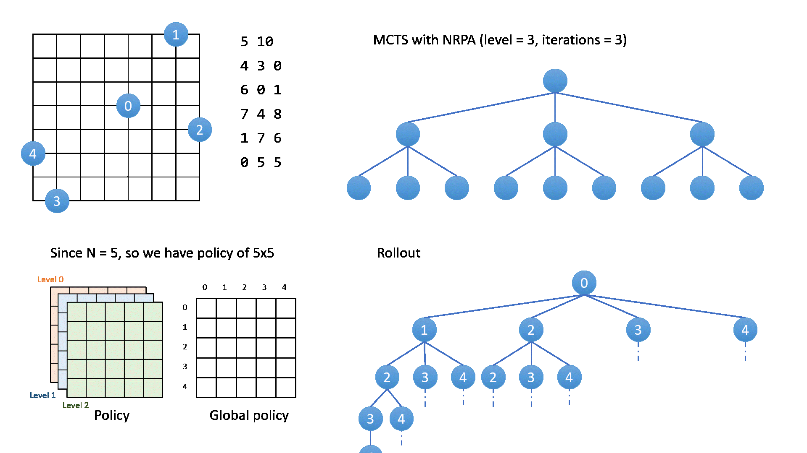
Rosin, C. D. (2011b). Nested rollout policy adaptation for Monte Carlo tree search (pp. 649–654). https://doi.org/10.5591/978-1-57735-516-8/ijcai11-115

## Output

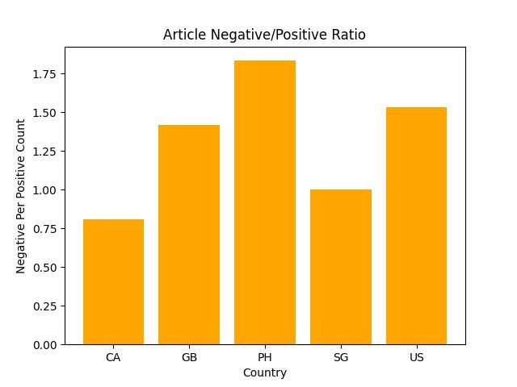
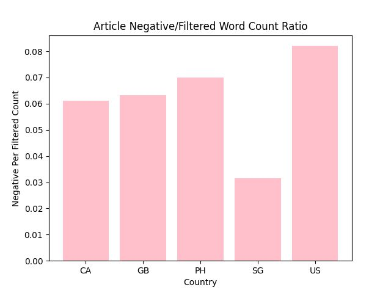
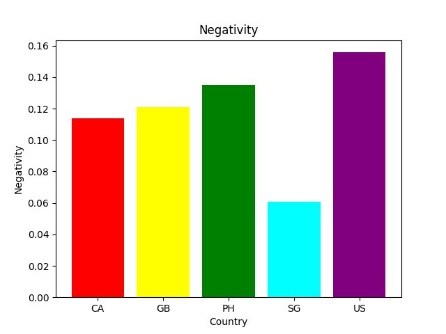
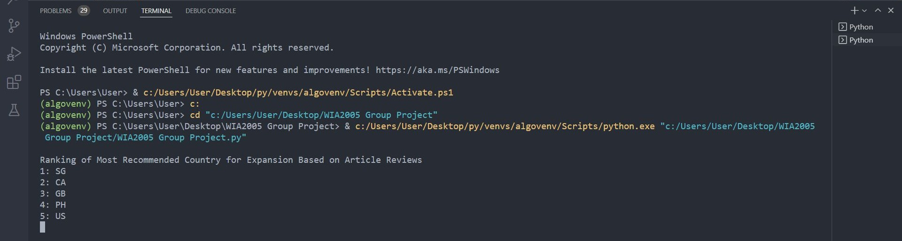
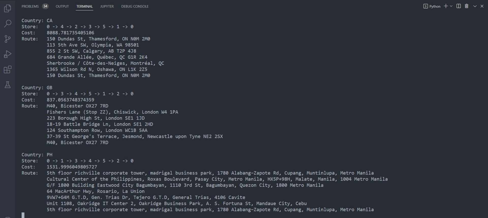
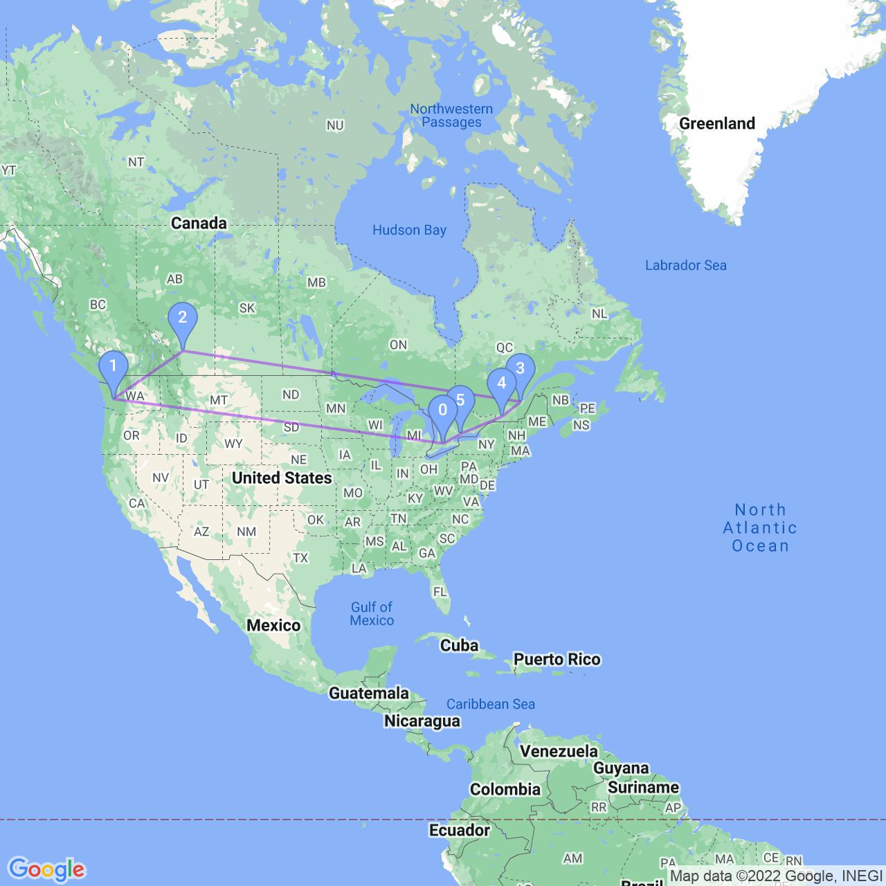
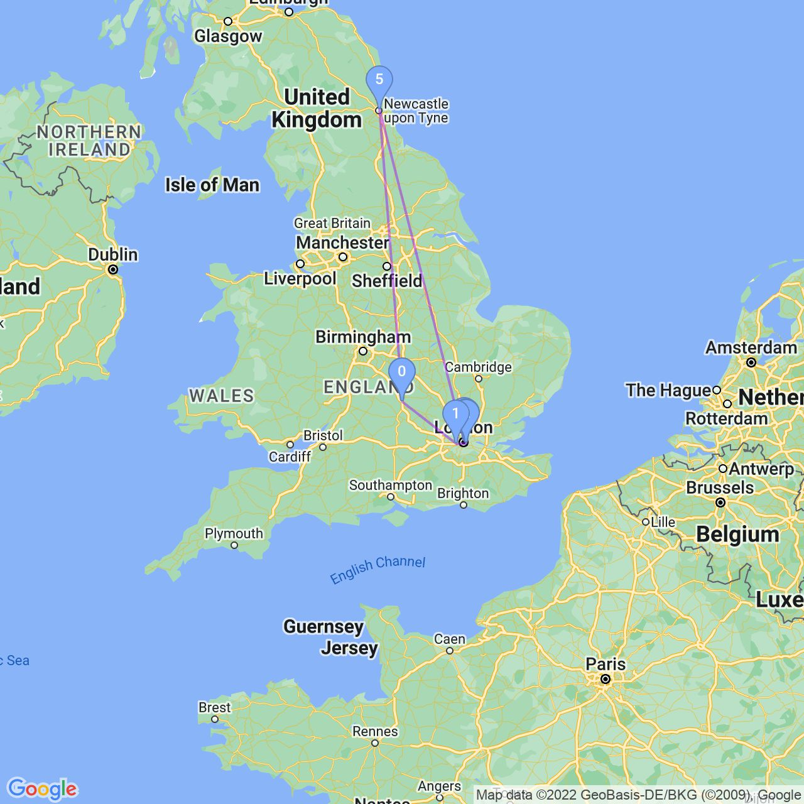
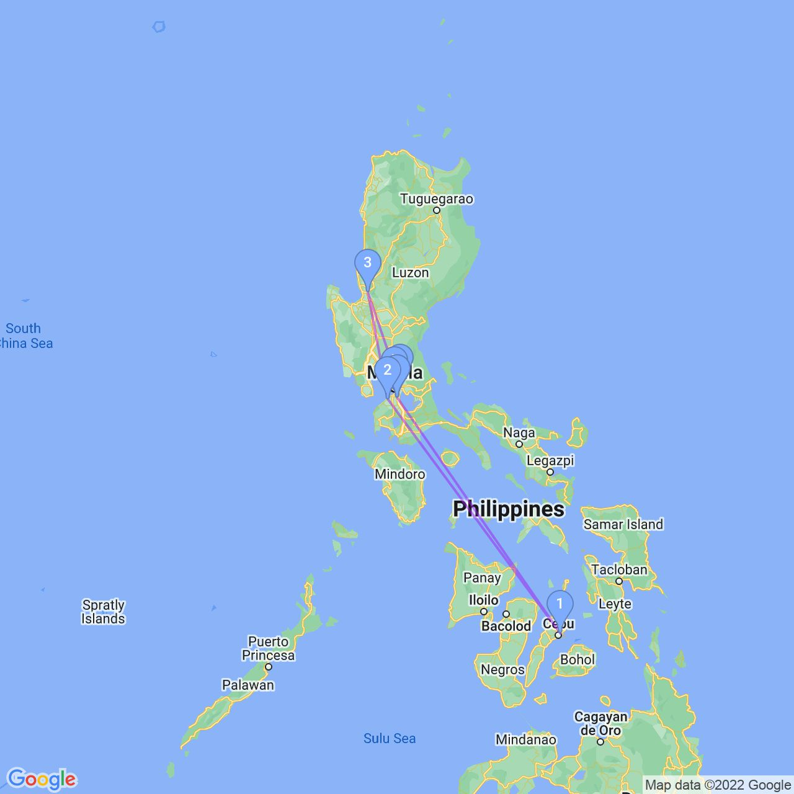
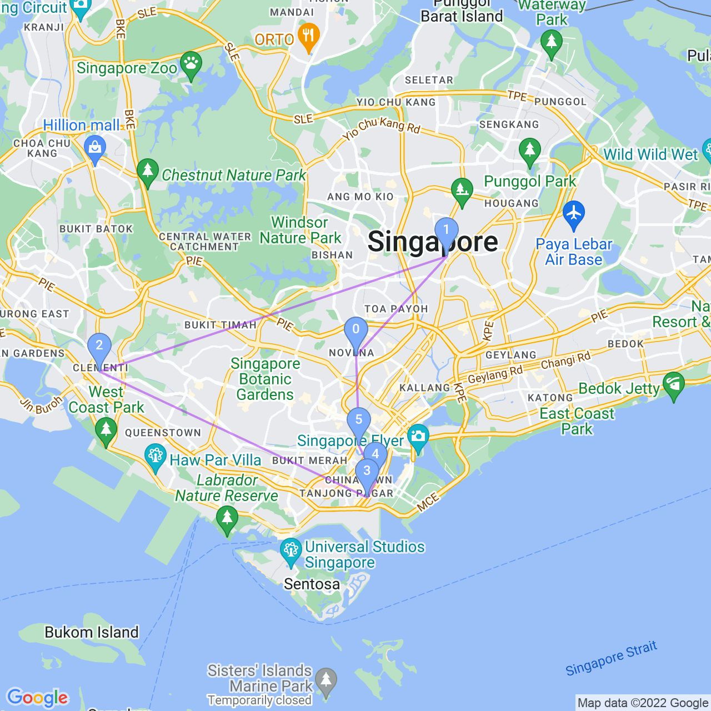
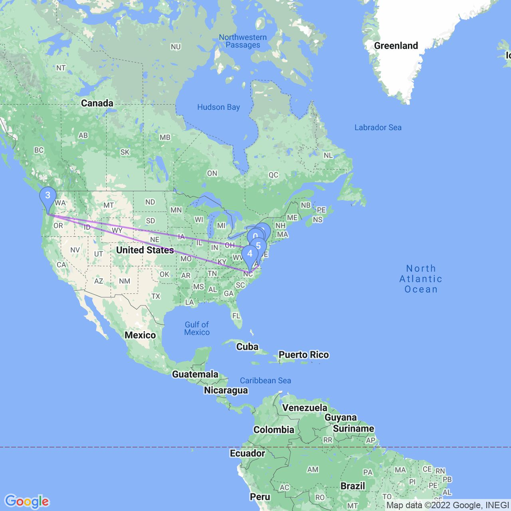

